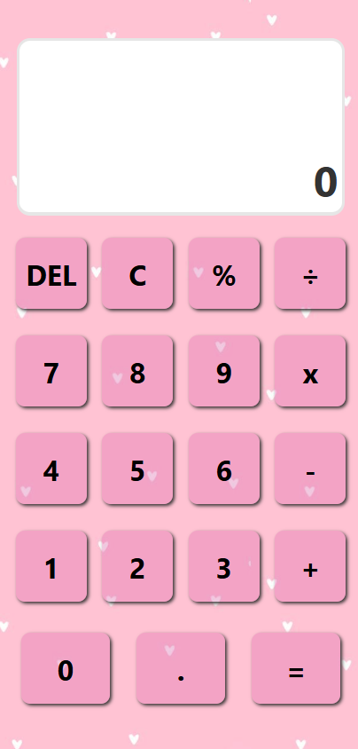

# 🧮 Calculadora

## 📋 Requisitos do Projeto

A aplicação deve atender aos seguintes requisitos:

- O valor inicial deve ser **0**;
- Botões numéricos de **1 a 9**;
- Botão para **apagar tudo** (`CA`);
- Botão para **apagar um único valor** (`C`);
- Botões de operadores:
  - `+` (adição)
  - `-` (subtração)
  - `*` (multiplicação)
  - `/` (divisão)
- Realizar operações com:
  - Valores **decimais**
  - Valores **inteiros**
- Campo de entrada (**input**) para digitação dos valores;
- Cálculo de **porcentagem (%)**;
- Botão `=` para exibir o resultado final.

## 🎨 Protótipo

